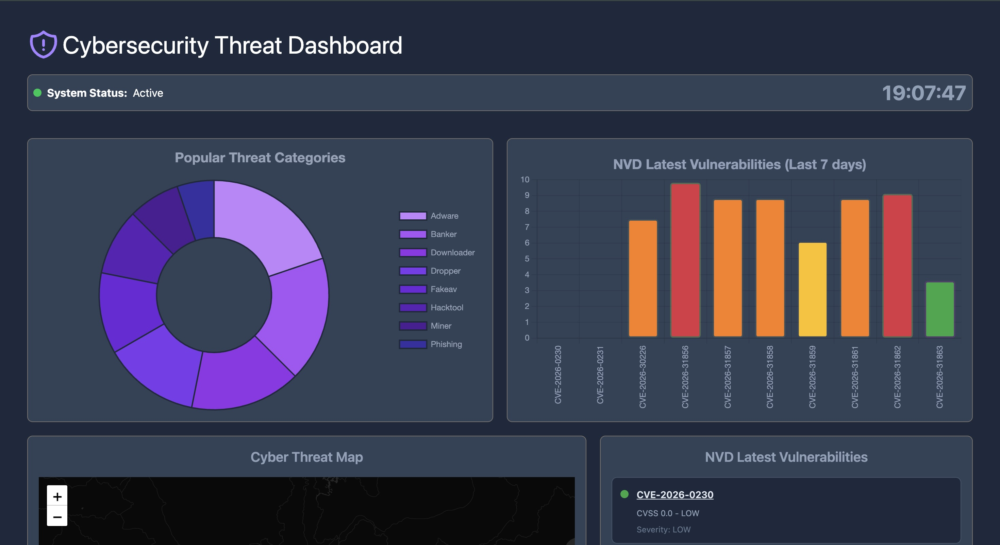

# Threat Dashboard Documentation



## Overview
Cybersecurity dashboard displaying real, up-to-date data from 3 different sources:
- **ISC SANS** (Internet Storm Center)
- **NVD NIST** (National Vulnerability Database)
- **VirusTotal** (Threat Intelligence)

The dashboard has five main charts:

1. The first chart (doughnut) uses `/api/popular-threats` and shows the top 8 threat categories from VirusTotal.

2. The second chart (bar chart) uses `/api/nvd-severity` and displays the top 10 CVEs from the last 7 days, colored by severity from NVD NIST.

3. The third chart (cyber threat map), under development.

4. The fourth graph is a list using `/api/nvd-severity` and displays all the latest vulnerabilities, with the option to learn more by going directly to the NVD NIST website.

5. The fifth graph (line chart) uses the `/api/attacks-trend` endpoint and shows the attack trend over the last 30 days with three lines for records, targets, and sources from ISC SANS.

## API Endpoints

| Endpoint | Data | Source | Chart | Update |
|----------|------|--------|-------|--------|
| `/api/attacks-trend` | 30-day attack trend (records, targets, sources) | **ISC SANS** | Line | **Daily** |
| `/api/nvd-severity` | Top 10 CVEs last 7 days (score, severity, colors) | **NVD NIST** | Bar/Scatter | **Real** |
| `/api/popular-threats` | Top 8 threat categories (% + name) | **VirusTotal** | **Doughnut** | **Real** |
| `/health` | API Status | - | - | - |

## Installation

1. Clone repository
```bash
git clone https://github.com/RykerWilder/cybersec-threat-dashboard
```

2. Insert Virus Total API Key
```bash
echo "VT_API_KEY=your_virustotal_key_here" > backend/.env
```

3. Start container (Startup around 30s)
```bash
docker compose up -d --build
```
